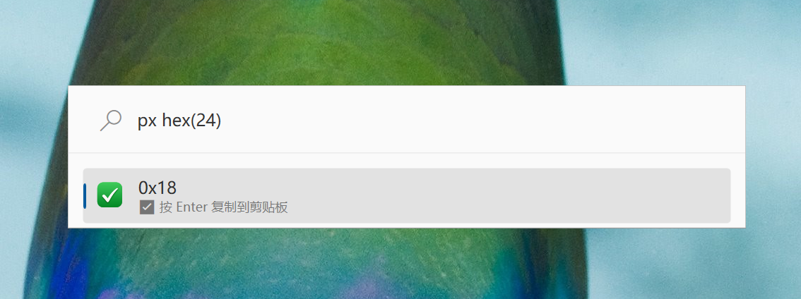

# PythonRun Plugin for PowerToys Run

A PowerToys Run plugin for running python code.

## Features

### Run python code

## Installation

### Manual

1. Download the latest release of the from the releases page.
2. Extract the zip file's contents to `%LocalAppData%\Microsoft\PowerToys\PowerToys Run\Plugins`
> 💡 Make sure the plugin folder (e.g., `PythonRun`) is placed directly inside `Plugins`.
3. Restart PowerToys.
> ⚠️ Ensure Python is installed and py.exe available in your system `PATH`.

## Usage

1. Open **PowerToys Run** (default shortcut: <kbd>Alt</kbd>+<kbd>Space</kbd>).
2. Type `px` followed by your Python code. Examples:
- `px 2 + 3 * 4`
- `px len("hello")`

The result will appear in the subtitle. Errors are shown with a red icon.

## Acknowledgements

This project was made possible thanks to these open-source projects:

- [**PowerToysRun-PluginTemplate**](https://github.com/8LWXpg/PowerToysRun-PluginTemplate) – MIT License  
A Visual Studio template for building PowerToys Run plugins.

We respect and comply with all respective licenses. See individual project repositories for license details.

## License

This project is licensed under the MIT License – see the [LICENSE](LICENSE) file for details.
